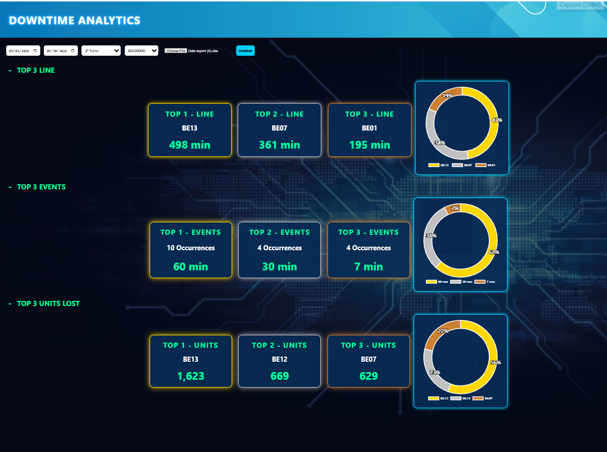
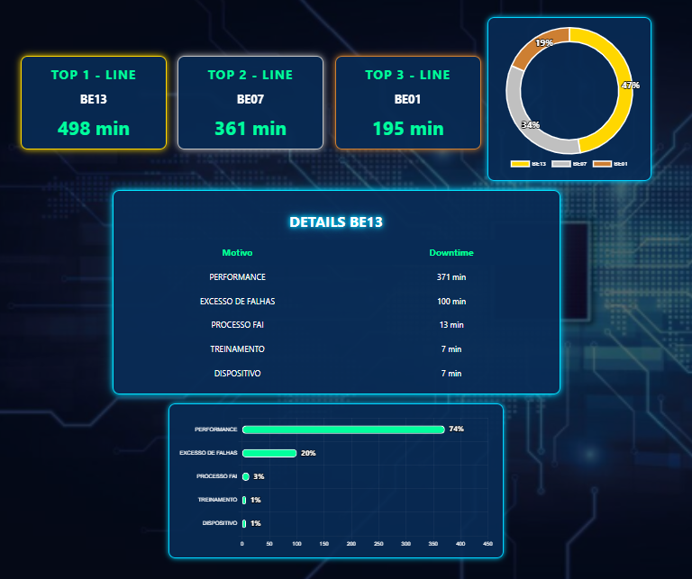
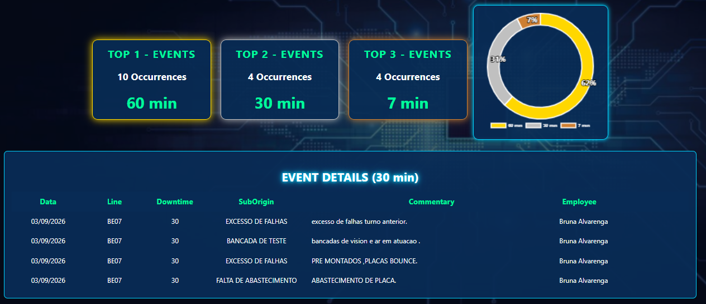
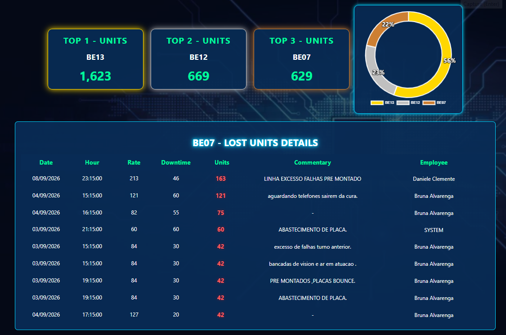

# DowntimeAnalytics
Dashboard para análise de downtime, eventos e unidades perdidas dentro de uma linha de produção.

## Recursos

- Top 3 Lines
- Top 3 Events
- Top 3 Units Lost
- Drill Down por linha
- Drill Down por eventos
- Drill Down por unidades perdidas
- Filtro por período
- Filtro por turno
- Filtro por área
- Importação Excel
- Percentuais nos gráficos

## Tecnologias

- HTML
- CSS
- JavaScript
- Chart.js
- XLSX.js

## Versões

### DowntimeAnalytics_WEB.html
Versão portátil para compartilhamento em rede.

### index.html
Versão de desenvolvimento modular.

## Screenshots

### Dashboard Principal

### Top Lines

Visualização das linhas com maior tempo de downtime.

### Top Events

Principais eventos responsáveis pelas paradas de produção.

### Top Units

Principais unidades perdidas dentro do downtime.

## Autor

William Lopes

🎓 Estudante de Engenharia de Software

🔧 Técnico de Manutenção Industrial e Tecnologia
